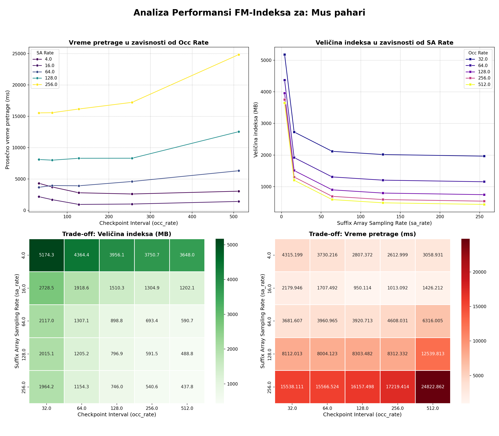
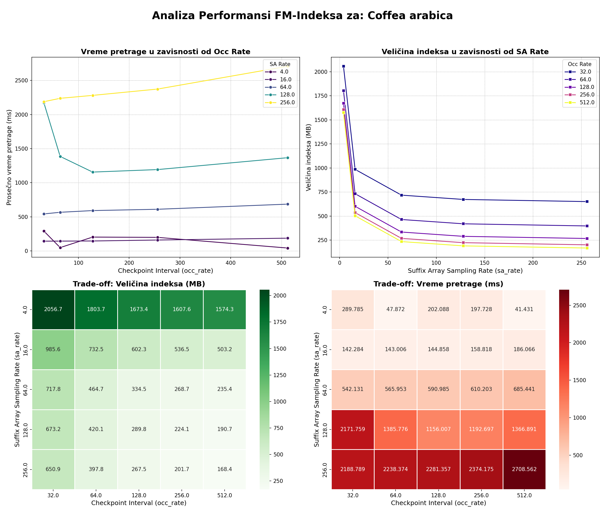

# Genomska informatika – Burrow-Wheeler transformacija i FM index

Ovaj repozitorijum sadrži implementacije i analizu FM-indeksa za pretragu genoma, kao i poređenje osnovne i optimizovane verzije FM-indeksa na realnim genomskim podacima.

## Sadržaj

- `main.py` – Glavni skript za pokretanje analize, benchmarka i upisa rezultata.
- `fm_index_basic.py` – Osnovna (neoptimizovana) implementacija FM-indeksa.
- `fm_index_optimized.py` – Optimizovana implementacija FM-indeksa sa checkpoint-ovima i uzorkovanjem sufiksnog niza.
- `genomes/` – FASTA fajlovi sa genomskim sekvencama za testiranje (npr. Coffea arabica, Mus pahari, Platypus).
- `plots/` – Grafička analiza rezultata (PNG slike).
- `results.csv` – Sumarni rezultati performansi za različite parametre.
- `analysis_log.txt` – Detaljan log pretraga i rezultata.
- `requirements.txt` – Lista Python zavisnosti.
- `test_fm_index.py` - Skripta za testiranje klasa koristeći unittest biblioteku.

## Pokretanje

1. Instalirajte zavisnosti:
	```bash
	pip install -r requirements.txt
	```

2. Pokrenite glavni skript:
	```bash
	python main.py
	```

3. Rezultati će biti upisani u `results.csv` i `analysis_log.txt`.

## Opis FM-indeksa

FM-indeks je efikasan indeks za pretragu podnizova u velikim tekstovima (npr. genomima), baziran na Burrows-Wheeler transformaciji i sufiksnom nizu. Ovaj repozitorijum sadrži dve verzije:

- **Osnovni FM-indeks**: koristi punu Occ matricu i nije optimizovan za memoriju.
- **Optimizovani FM-indeks**: koristi checkpoint-ove i uzorkovanje sufiksnog niza za značajnu uštedu memorije.

## Benchmark dataset-i

U folderu `genomes/` nalaze se FASTA fajlovi sa realnim genomskim sekvencama. Skripta automatski testira više parametara za optimizovani FM-indeks i upisuje rezultate.

## Vizualizacija

Rezultati analize mogu se vizualizovati grafovima iz foldera `plots/`.

Primeri analize:

**Mus pahari:**



**Coffea arabica:**




## Projekat
Ovaj projekat je realizovan u okviru predmeta "Genomska informatika" na master studijama Elektrotehničkog fakulteta Univerziteta u Beogradu.

Studenti:
- Teodora Srećkovič 24/3
- Anastasija Rakić 24/3105
