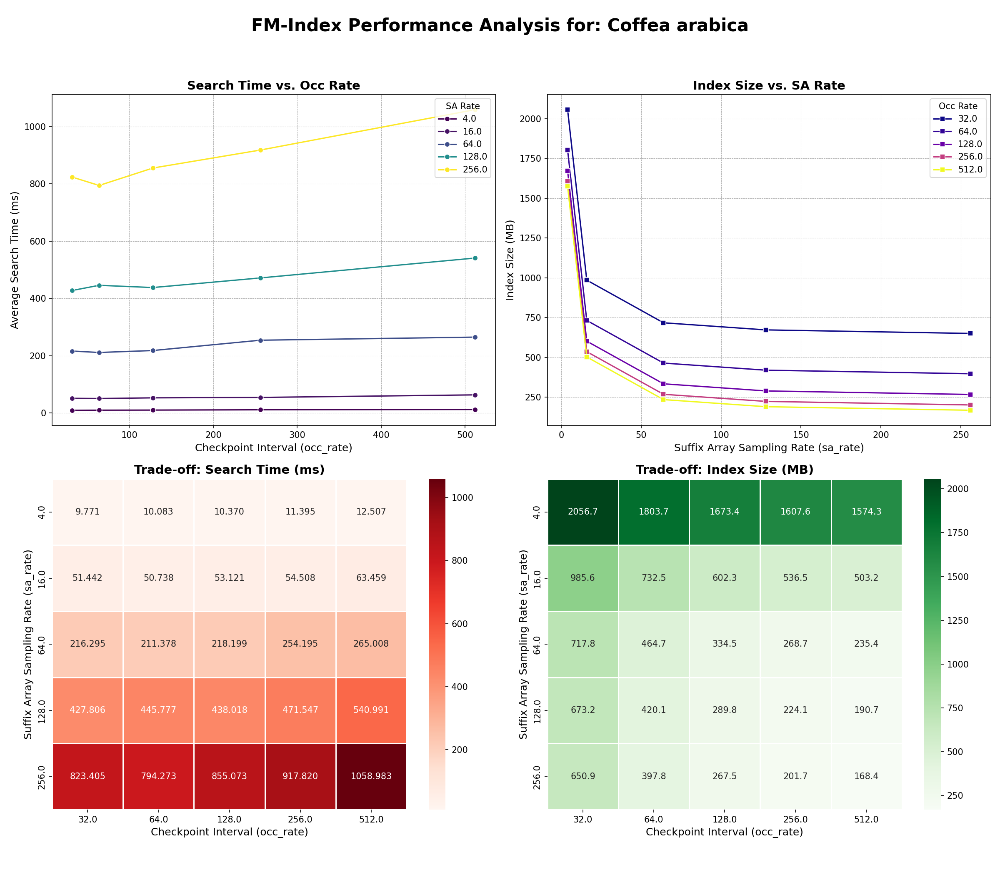
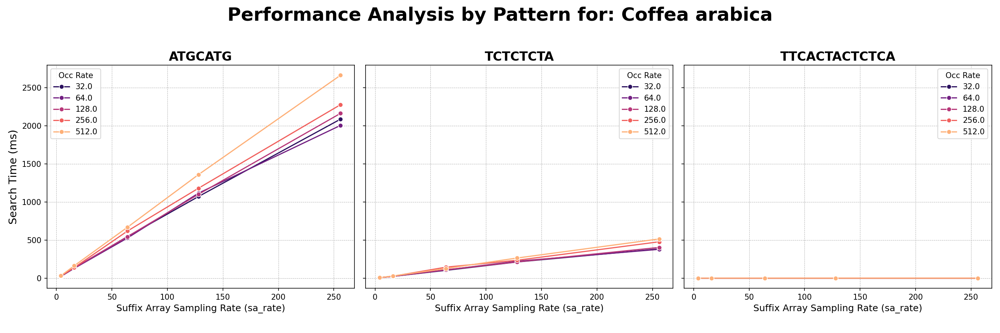
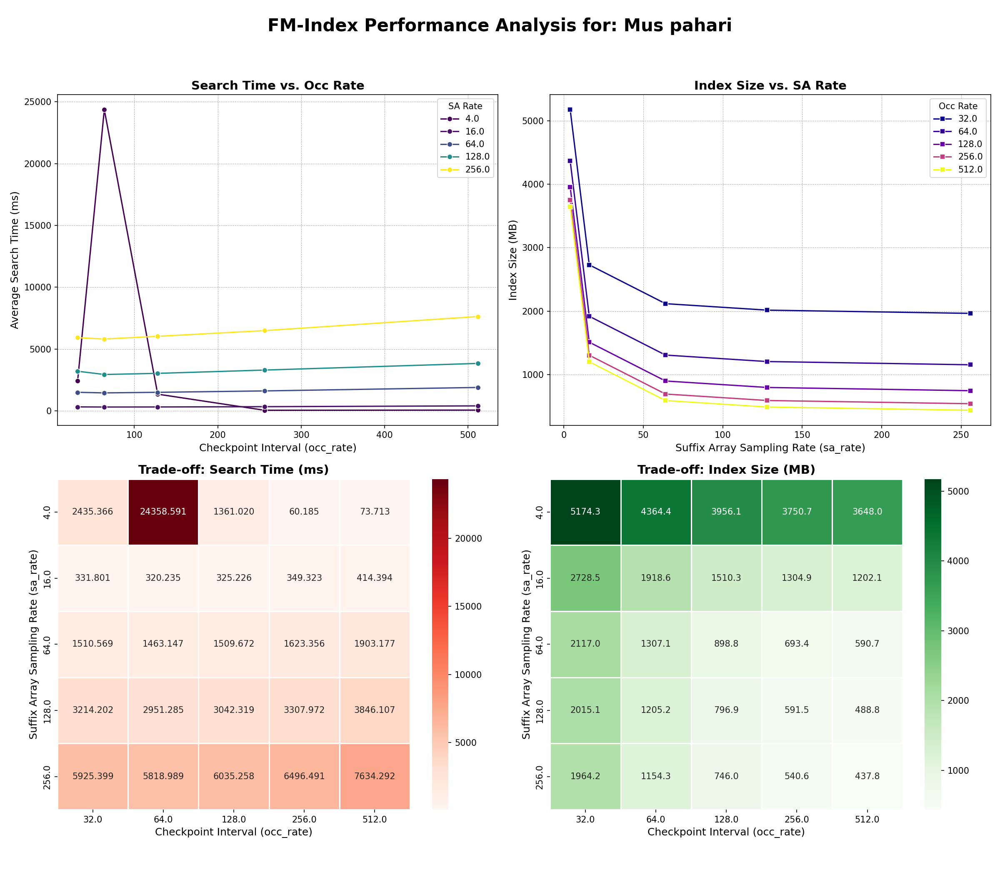
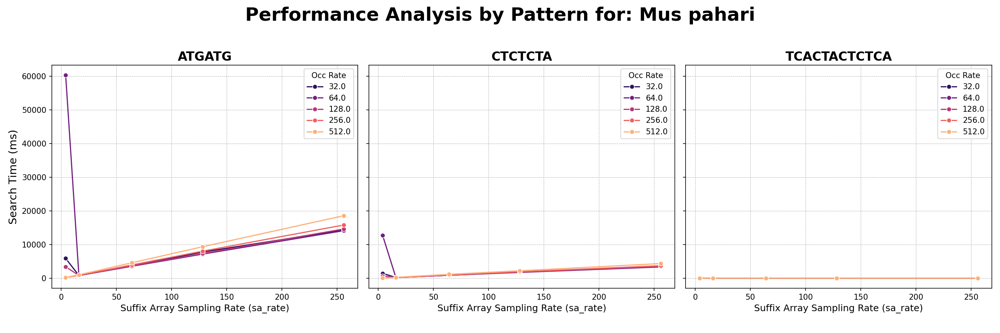
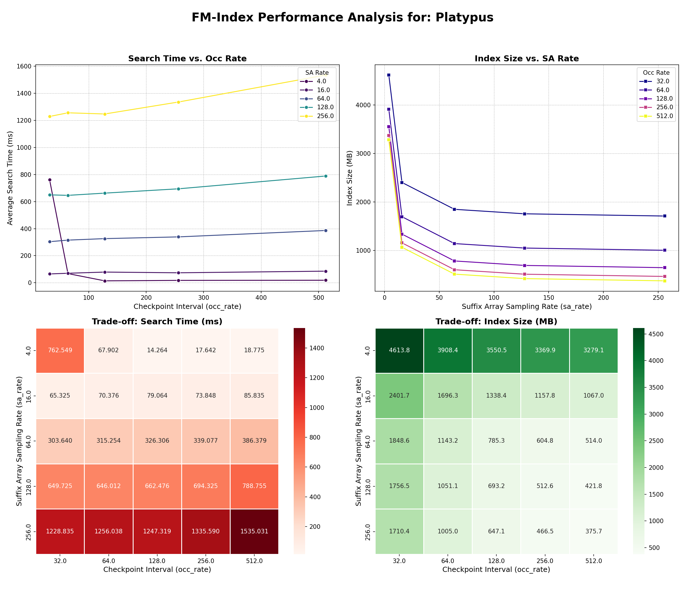
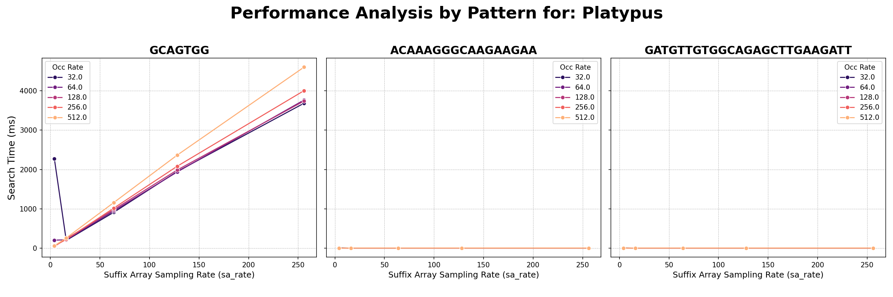

# Genomic Informatics – Burrows-Wheeler Transform and the FM-Index

This repository contains a project for the *Genomic Informatics* course at the Master's program, School of Electrical Engineering, University of Belgrade. It focuses on the **Burrows-Wheeler Transform (BWT)** and the **FM-Index**, tools for efficient indexing and string searching in genomic data.

## Repository Structure

- `main.py` – Runs analysis, benchmarks, and saves results  
- `fm_index_basic.py` – Basic FM-Index implementation  
- `fm_index_optimized.py` – Optimized FM-Index using checkpointing and suffix array sampling  
- `genomes/` – Genomic sequences (FASTA files) for testing  
- `plots/` – Performance charts and heatmaps  
- `results.csv` – Summary of performance metrics  
- `analysis_log.txt` – Log of all search queries and results  
- `requirements.txt` – Python dependencies  
- `test_fm_index.py` – Unit tests for FM-Index implementations  

## Getting Started

1.  **Install the dependencies:**
    ```bash
    pip install -r requirements.txt
    ```

2.  **Run the main analysis script:**
    ```bash
    python main.py
    ```

3.  Generate visualizations:
    ```bash
    python visualize.py
    ```

## FM-Index Implementations

The FM-Index is built on top of the Burrows-Wheeler Transform (BWT) and supports fast substring queries in large texts like genomes. This project includes two versions:  

- **Basic Implementation** – Stores the entire occurrence matrix (character counts for each position) and the full suffix array. This approach is highly memory-intensive and scales poorly with large genomes.  

- **Optimized Implementation** – Reduces memory consumption through:  
  - **Checkpointing**: Stores character counts only at fixed intervals (e.g., every 128th position).  To find the count at any other position, it retrieves the nearest checkpoint and computes the remaining counts.  
  - **Suffix Array Sampling**: Keeps only every *k*-th suffix array entry. Positions not directly stored are resolved using backward steps with the BWT until a sampled entry is reached.  

This trade-off balances **speed and memory usage**, making the optimized version more practical for large-scale genomic analysis.

## Benchmarking & Visualization

The `genomes/` folder includes real genomic sequences. Benchmarks evaluate the performance of both implementations across parameters such as checkpoint intervals and sampling rates.  

The results are summarized in `results.csv` and visualized as charts and heatmaps under `plots/`, showing the trade-offs between index size (memory) and query time.  

### Example Analyses


#### *Coffea arabica*  
**Average Search Time**
  
**By pattern:**
 

#### *Mus pahari*  
**Average Search Time**
  
**By pattern:**


#### *Platypus*  
**Average Search Time**
  
**By pattern:**



---

## References

- Burrows, M., & Wheeler, D. J. (1994). *A block-sorting lossless data compression algorithm*. Digital Equipment Corporation. [Link](https://web.archive.org/web/20060427023016/http://www.hpl.hp.com/techreports/Compaq-DEC/SRC-RR-124.pdf)  
- Ferragina, P., & Manzini, G. (2000). *Opportunistic data structures with applications*. In *FOCS 2000*. IEEE. [Link](https://people.unipmn.it/manzini/papers/focs00draft.pdf)  

---

## Students 
- Tedora Srećković 2024/3250
- Anastasija Rakić 2024/3105

